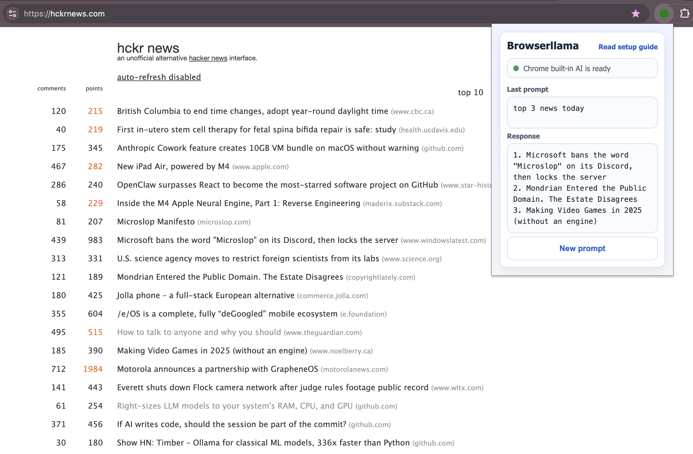

# Browserllama

A chrome extension for integrating a local running Ollama server into your browser.

## Prerequisites

- Chrome browser
- Ollama server running locally
- At least one LLM model installed locally (from the supported models in this plugin, or you can edit the code and add your own)

## Features

- Send messages to local Ollama server and get responses
- Select LLM of own choice you installed locally

## Why

- I want to use Ollama on my browser and I want to run it all locally with the LLM model I can select.

## How does it look?



## Install

- Download the code and load the `src/` folder manually into chrome extensions (chrome://extensions/)
- Make sure your Ollama server is running and accessible at `http://localhost:11434/api/generate`
- You can also run CLI `ollama serve` to start the server (instead of running the actual application), but make sure you set up the environment variables for the server to run, i.e. to allow CORS for chrome-extension://[ID] (you can find out the ID after you install the extension), for example I added these to my .bashrc file (more info [here on this github issue](https://github.com/ollama/ollama/issues/6489)):

```bashrc
export OLLAMA_ALLOW_ORIGINS=chrome-extension://moemjknfmlpkgamlcdnmpobaakdpindc
export OLLAMA_ORIGINS=chrome-extension://*
```

## Testing

### Unit tests

1. Install dev dependencies:

```bash
pnpm install
```

2. Run unit tests:

```bash
pnpm test
```

### E2E (extension UI)

1. Install Playwright and the Chromium browser:

```bash
pnpm exec playwright install chromium
```

2. Run the E2E test (headed by default so you can see the UI):

```bash
pnpm run e2e
```

3. Run headless if desired:

```bash
HEADLESS=1 pnpm run e2e
```
