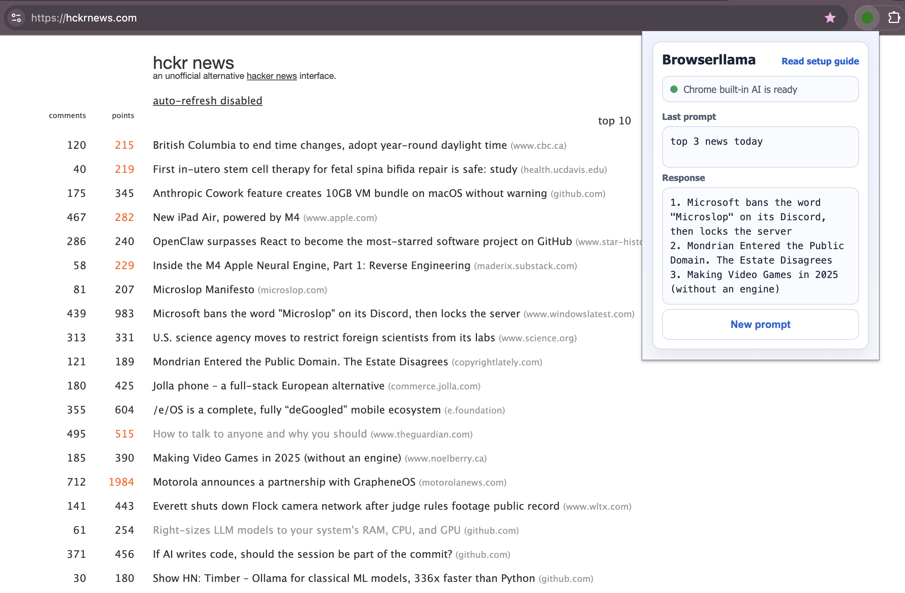

# Browserllama

[](./LICENSE)
[](#testing)
[](https://developer.chrome.com/docs/extensions/mv3/intro/)

Local-first AI assistant for Chrome pages.
Browserllama lets you ask questions about the current tab using:

- Ollama running on your machine
- Chrome built-in AI (when supported by your Chrome build)

## Docs Hub

Use the public setup + fallback docs page:

- [Browserllama GitHub Pages](https://vmandic.github.io/browserllama/)

This page includes setup guides, troubleshooting, and FAQ links with section anchors.

## Screenshot



## Features

- Prompt against the current page context.
- Provider switch between Ollama and Chrome built-in AI.
- Model selection for Ollama providers.
- Compact popup workflow with prompt/response history.
- Fallback docs link in the popup header.

## Code Structure

Current extension code is organized by feature boundaries and naming conventions.

- Providers end with `-provider.js`.
- Services end with `-service.js`.
- Prompt steering and injection checks stay centralized in `src/lib/ollama.js`.

```text
src/	- extension source root
├── background.js	- thin service-worker entry that wires background services
├── background/	- background service modules
│   ├── storage-service.js	- reads synced extension preferences
│   ├── ollama-service.js	- Ollama HTTP calls and response normalization
│   ├── icon-status-service.js	- action icon/title status updates
│   ├── tab-context-service.js	- active-tab tracking and text extraction
│   └── message-router-service.js	- runtime message action routing
├── lib/
│   └── ollama.js	- shared prompt building, guardrails, injection checks, response cleaning
└── ui/
    └── popup/	- popup UI entry and modules
        ├── popup.html	- popup markup entry
        ├── popup.css	- popup styles
        ├── main.js	- popup bootstrap and event wiring
        ├── dom.js	- required DOM node resolution
        ├── state.js	- mutable popup state shape
        ├── components/
        │   ├── compose-view.js	- compose and control rendering helpers
        │   ├── response-view.js	- response/prompt rendering helpers
        │   └── status-view.js	- provider status rendering helpers
        ├── logic/
        │   ├── prompt-logic.js	- prompt lifecycle orchestration
        │   └── provider-logic.js	- provider readiness orchestration
        ├── providers/
        │   ├── chrome-built-in-provider.js	- Chrome built-in generation API integration
        │   └── ollama-provider.js	- Ollama generation/model API integration
        └── services/
            ├── page-context-service.js	- active-page capture helpers
            └── popup-storage-service.js	- popup storage read/write helpers

tests/	- automated test suites
├── unit/
│   └── ollama.test.mjs	- shared helper and guardrail unit tests
└── e2e/
    └── extension.spec.js	- end-to-end extension flow tests
```

## Quick Start

### 1) Clone and install

```bash
git clone https://github.com/vmandic/browserllama.git
cd browserllama
pnpm install
```

### 2) Load extension in Chrome

1. Open `chrome://extensions`.
2. Enable **Developer mode**.
3. Click **Load unpacked**.
4. Select the `src/` folder.

### 3) Prepare provider

#### Option A: Ollama (recommended default)

1. Install Ollama from [ollama.com](https://ollama.com/).
2. Start the server:

```bash
ollama serve
```

3. Pull at least one model:

```bash
ollama pull deepseek-r1:8b
```

4. Open Browserllama popup and keep provider on **Ollama**.

#### Option B: Chrome built-in AI

1. Use a compatible Chrome build and account setup.
2. Enable required AI-related flags in `chrome://flags`.
3. Relaunch Chrome.
4. In popup provider dropdown, select **Chrome built-in AI**.

If the provider is unavailable, see the docs hub troubleshooting section:
[https://vmandic.github.io/browserllama/#troubleshooting-chrome-ai](https://vmandic.github.io/browserllama/#troubleshooting-chrome-ai)

## Configuration Notes

Browserllama defaults to `http://localhost:11434` for Ollama.

If you use `ollama serve` and need to allow extension origins, set environment vars (example):

```bash
export OLLAMA_ALLOW_ORIGINS="chrome-extension://<your-extension-id>"
export OLLAMA_ORIGINS="chrome-extension://*"
```

Reference discussion:
[https://github.com/ollama/ollama/issues/6489](https://github.com/ollama/ollama/issues/6489)

## Testing

### Unit tests

```bash
pnpm test
```

### E2E tests

Install Chromium for Playwright (first run only):

```bash
pnpm exec playwright install chromium
```

Run e2e (headed):

```bash
pnpm run e2e
```

Run e2e (headless):

```bash
HEADLESS=1 pnpm run e2e
```

### E2E caveat (headless)

For this project, Playwright e2e tests are reliable in **headed** mode (`pnpm run e2e`), and that is the recommended way to run them.

`HEADLESS=1` can be unstable with MV3 extension startup (service worker/extension load timing) and may fail even when headed runs pass.

## Roadmap Tasks

Backlog specs live under [`.llm/backlog/`](.llm/backlog/) and feature work items under [`.llm/backlog/feats/`](.llm/backlog/feats/).

## License

MIT. See [`LICENSE`](LICENSE).
